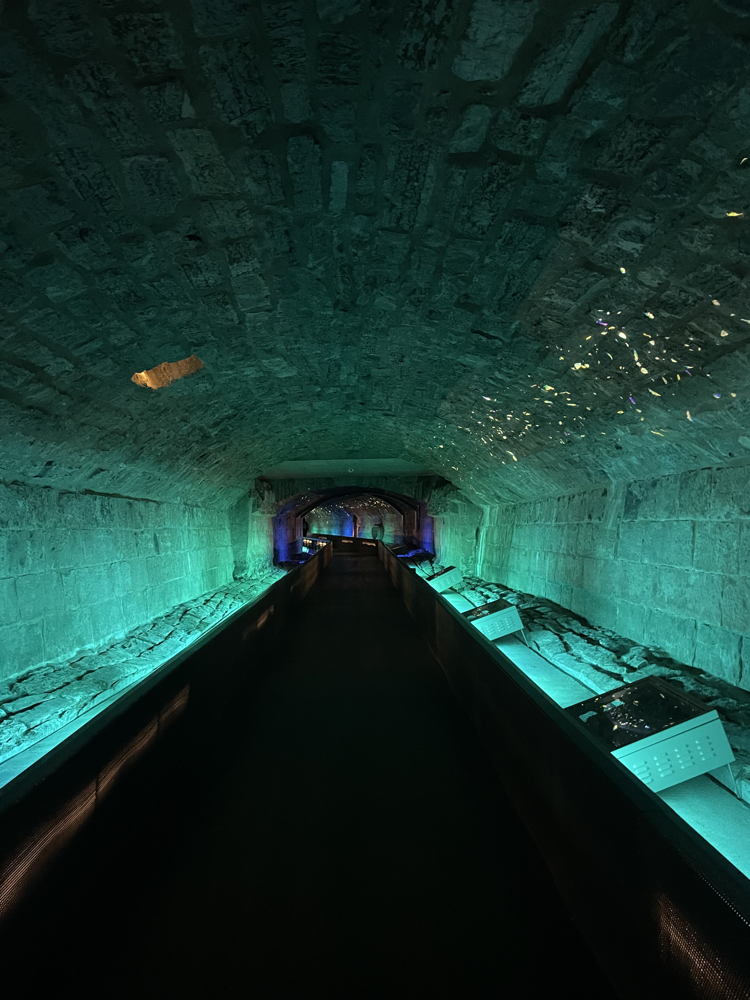
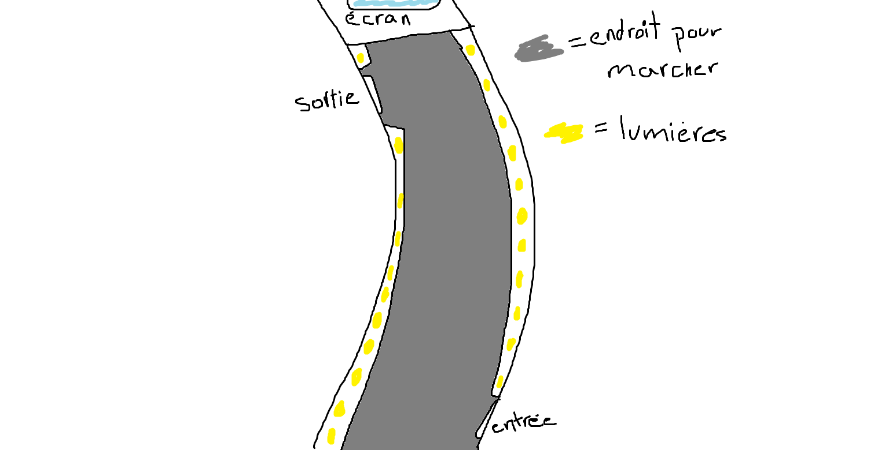
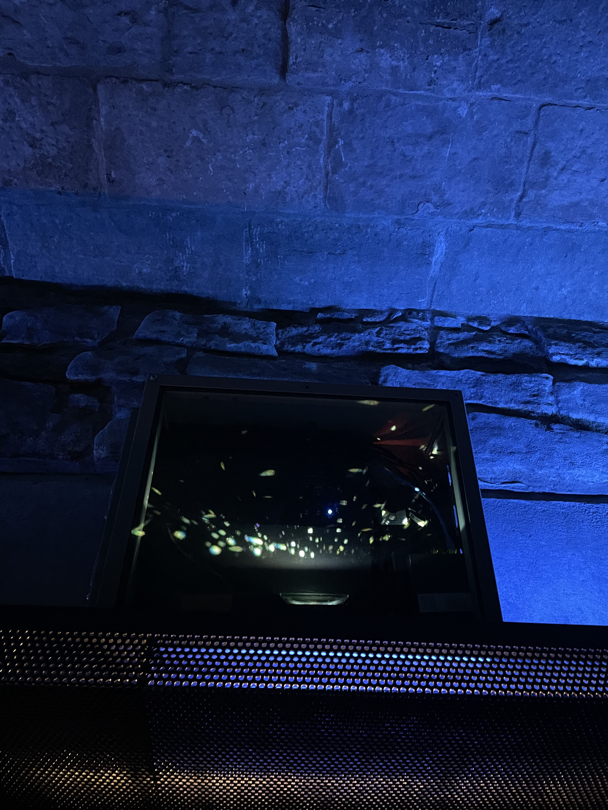
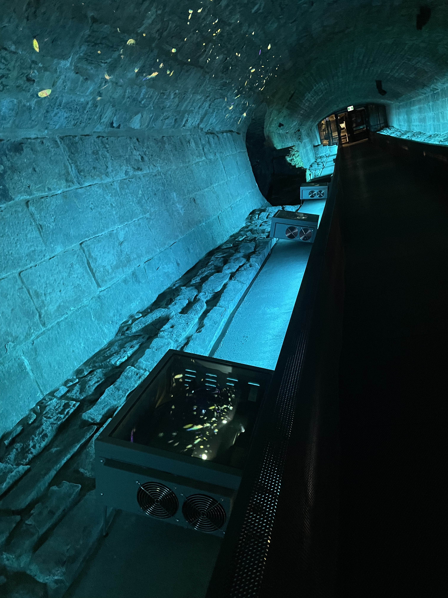
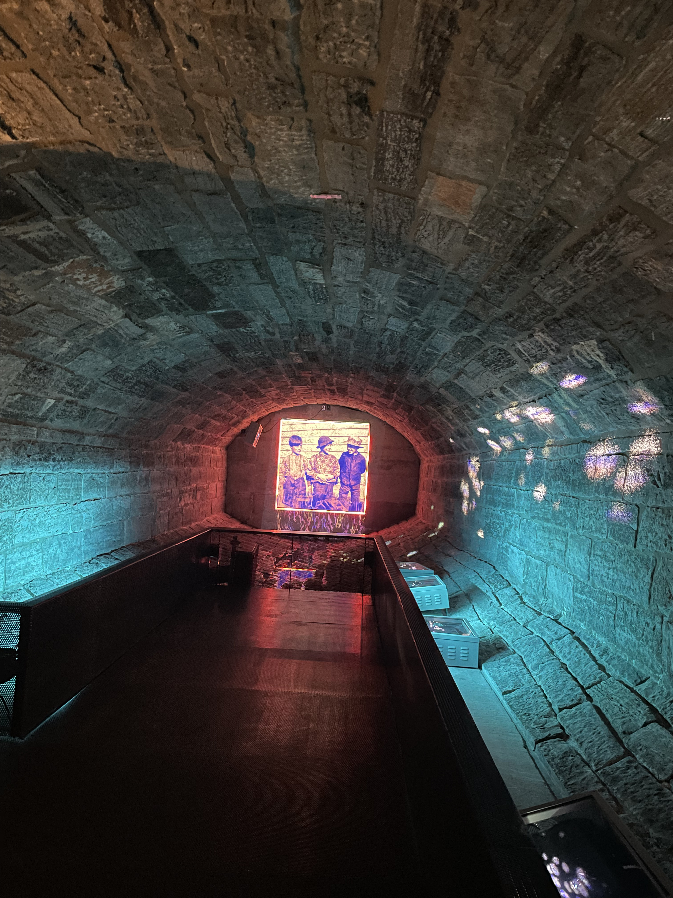
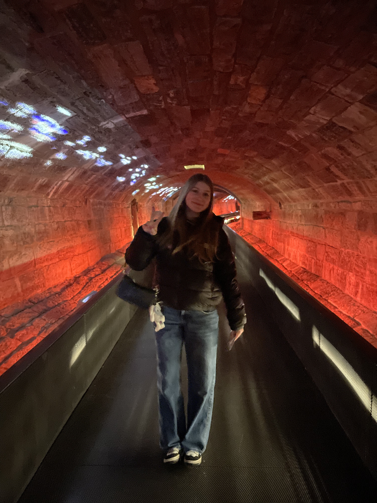

## Collecteur de mémoires ##

Affiche qui nous indique l'exposition, photo par Amélie Veilleux

------------
 
J'ai eu la chance d'aller voir l'exposition permanante : Collecteur de mémoires le 23 février 2025. 

### Plus d'informations ###
Comme mentionné plus tôt, cette exposition est permanente et est présentée depuis mai 2017. Elle a vu le jour grâce à Moment Factory, le collaborateur principal du projet.
Cette exposition met en valeur le tout premier égout collecteur construit en Amérique du Nord, entre 1832 et 1838. Sur une distance de 110 mètres, les visiteurs se promènent dans cet égout transformé en un lieu fascinant, rempli de lumières et de surprises. Son côté immersive est ce qui le rends si spécial.

Photo d'ensemble de l'exposition, photo par Amélie Veilleux

***Ils sont appelés à vivre une expérience multisensorielle et réflexive grâce à l’installation Collecteur de mémoires, un ingénieux mécanisme de projections lumineuses sur les parois en pierre, dans un environnement sonore spécialement créé pour l’occasion.***

Source : Site Web de Pointe-à-Callière, https://pacmusee.qc.ca/fr/expositions/detail/collecteur-de-memoires/

### Mise en espace ###

Croquis réalisé par Amélie Veilleux :)

### Composantes et techniques ###
Le composant principal de cette exposition est constitué des lumières et des projecteurs utilisés pour créer les couleurs que nous voyons. Ceux-ci sont dispersés tout au long de l'égout.

Lumière utilisée, photo par Amélie Veilleux

Plusieurs lumières utilisées, photo par Amélie Veilleux

De plus, il y a un projecteur à la fin du corridor qui montre une vidéo contenant des anciennes photos prises à Montréal. 

Projection des images, photo par Amélie Veilleux

### Éléments nécessaires à la mise en exposition ###
Bien sûr, l’élément principal de cette exposition est l’égout : sans lui, il n’y aurait tout simplement pas d’exposition. Ensuite, comme mentionné plus haut, des projecteurs et des jeux de lumière permettent de nous immerger dans l’environnement. Pour terminer, des pancartes sont disposées au début et à la fin du parcours.
Malgré la simplicité des éléments, cette exposition parvient réellement à nous plonger dans un autre univers.

### Opinions ###
Personnellement, je trouve cette exposition incroyable. La simplicité de celle-ci lui donne tout son charme : 110 mètres à marcher, en observant les couleurs et les éléments qui nous entourent. Les photos à la fin retiennent tellement notre attention que l’on pourrait y rester des heures. De plus, cette exposition nous permet d’en apprendre davantage sur l’histoire de Montréal. Ce n’était pas la première fois que je visitais ce musée, et ce ne sera certainement pas la dernière. Ce musée est parfait pour en apprendre plus sur le passé de Montréal, un lieu très important dans notre histoire.

Photo par Florence Péloquin Chamberland
