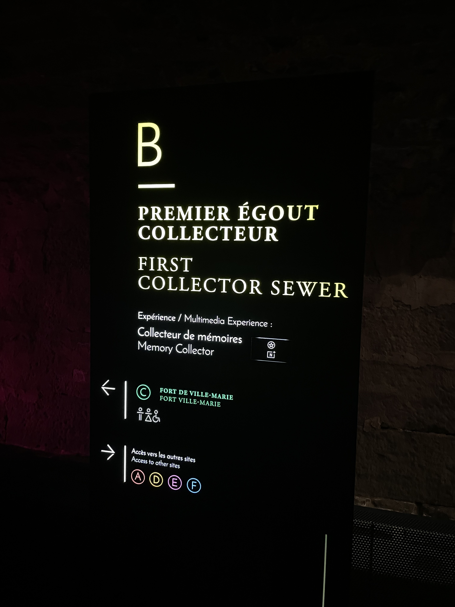

## Collecteur de mémoires ##

Photo par Amélie Veilleux

------------
 
J'ai eu la chance d'aller voir l'exposition permanante : Collecteur de mémoires le 23 février 2025. 

### Plus d'informations ###
Comme mentionné plus tôt, cette exposition est permanente et est présentée depuis mai 2017. Elle a vu le jour grâce à Moment Factory, le collaborateur principal du projet.
Cette exposition met en valeur le tout premier égout collecteur construit en Amérique du Nord, entre 1832 et 1838. Sur une distance de 110 mètres, les visiteurs se promènent dans cet égout transformé en un lieu fascinant, rempli de lumières et de surprises. Son côté immersive est ce qui le rends si spécial.

Photo par Amélie Veilleux

### Mise en espace ###

Croquis réalisé par Amélie Veilleux :)

### Composantes et techniques ###
Le composant principal de cette exposition est constitué des lumières et des projecteurs utilisés pour créer les couleurs que nous voyons. Ceux-ci sont dispersés tout au long de l'égout.

Photo par Amélie Veilleux

Photo par Amélie Veilleux

De plus, il y a un projecteur à la fin du corridor qui montre une vidéo contenant des anciennes photos prises à Montréal. 

Photo par Amélie Veilleux
