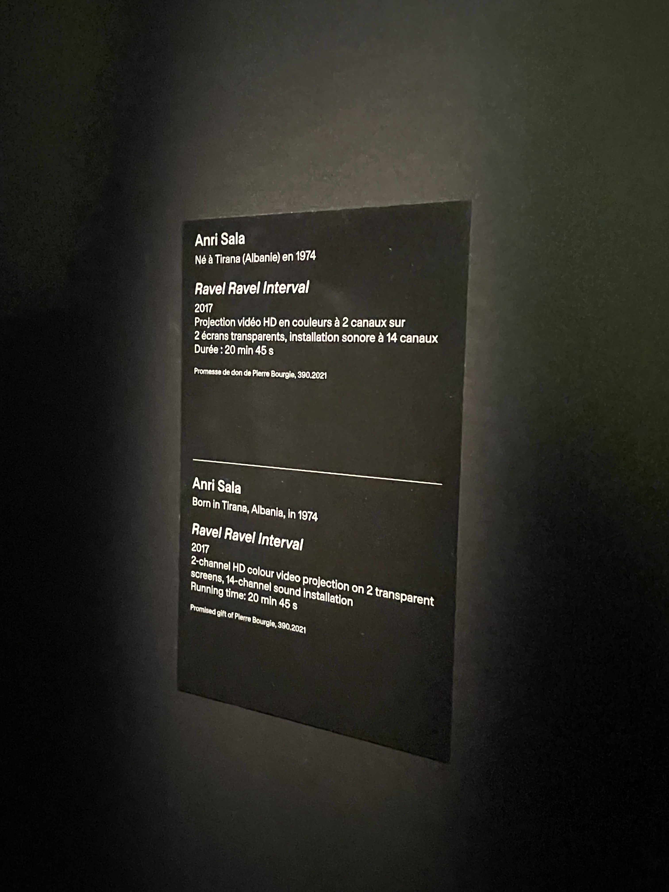
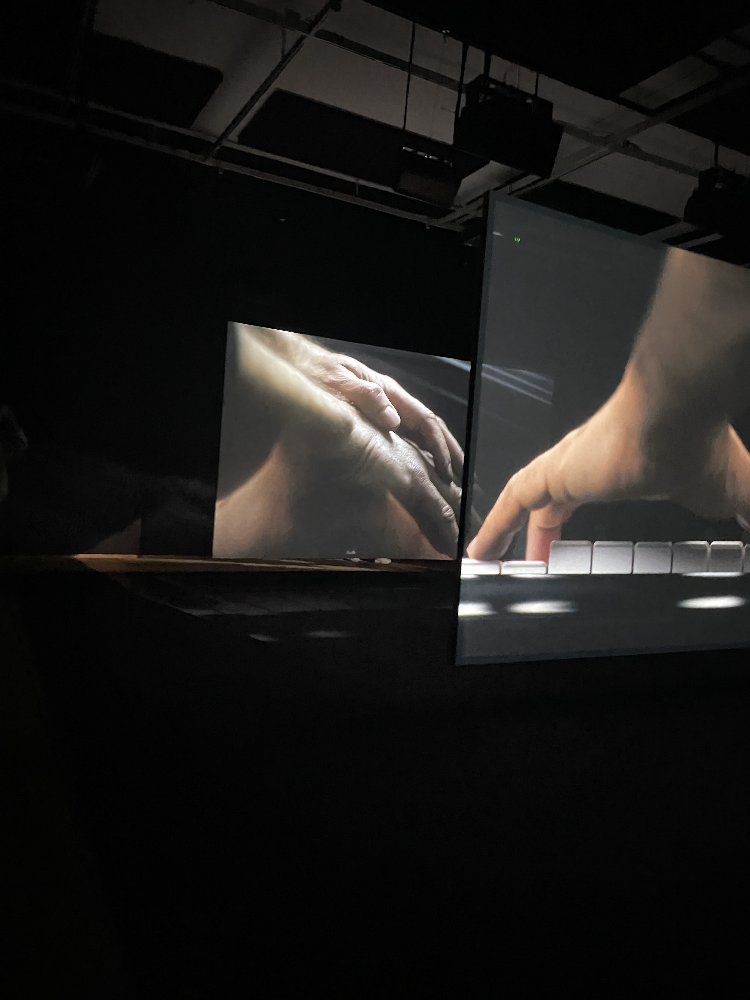
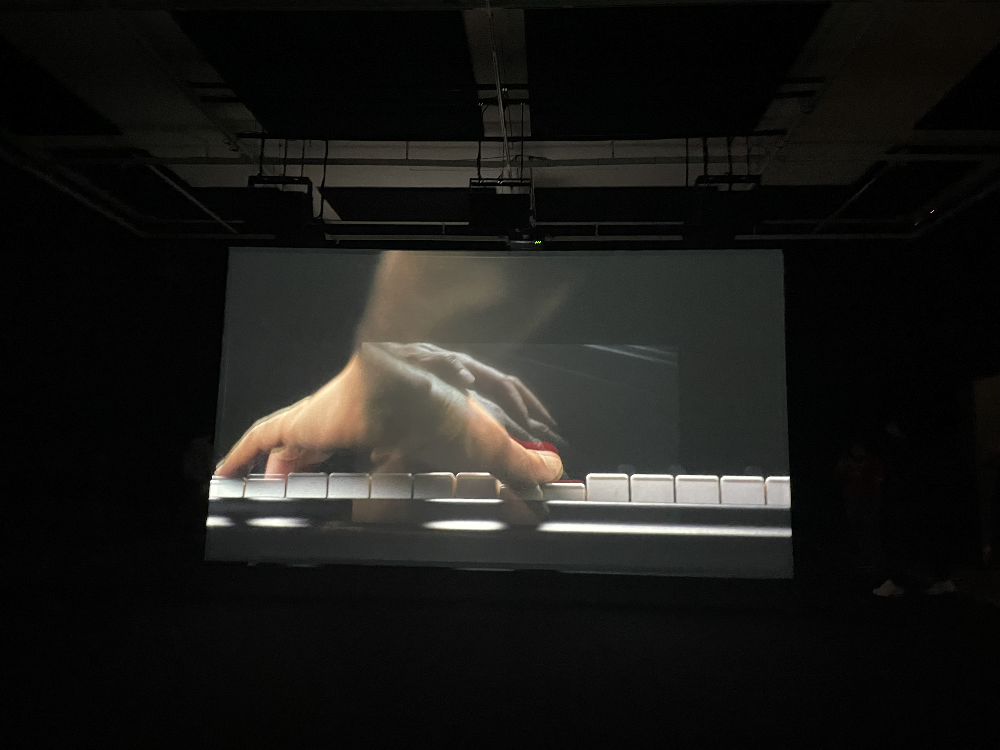

## Anri Sala : Ravel Ravel Interval ##

Cette exposition est présenté au Musée des beaux-arts de Montréal est une installation vidéo immersive par Anri Sala créée en 2013 mais modifié en 2017. Nous avons eu la chance d'aller voir cette oeuvre le 4 avril 2025. 

Affiche de l'exposition, photo par Amélie Veilleux

-------

Cette oeuvre très immersive est constitué de deux énormes écrans transparents avec deux vidéos différentes projetés dessus. Tout cela est accompagné de deux musiques différentes de 20 min45 s associées chacune à une vidéo. 

Écrans transparents utilisés, photo par Amélie Veilleux

Comme on peut le voir dans l'image plus haut, les vidéos consiste à une main qui joue du piano, chaque vidéo est une mélodie différente. 
L'exposition est mise en place que deux écrans transparents sont une en arrière de l'autre, chacunes ayant sa propre projection, il y a 14 hauts-parleurs situés dans la salle.

