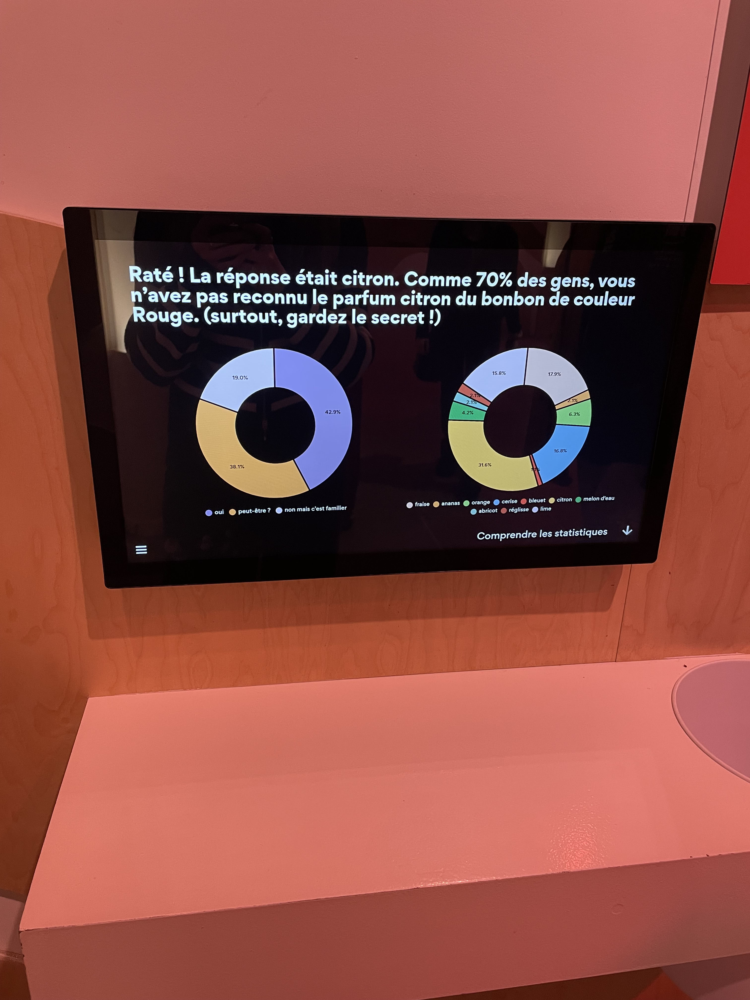
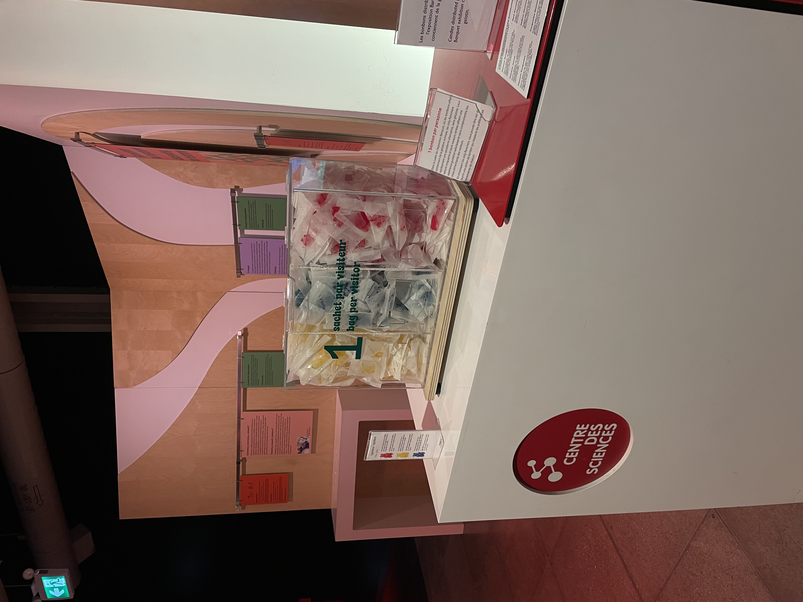
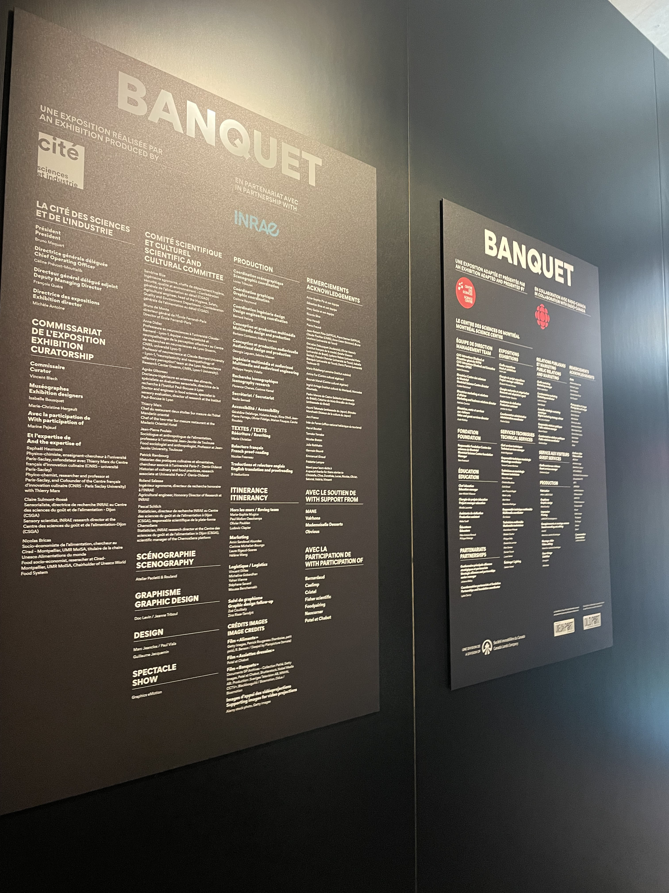

# Centre des sciences de Montréal #
## Le Banquet ##

---------------
Le banquet est une exposition de type permanante qui utilise les cinq sens humain de plusieurs façons surprenantes. Nous avons eu la chance de voir cette exposition le 31 janvier 2025. 

Cependant, un dispotif en particulier m'a intéressé: Goûter la couleur
---------------

Cette expérience consistait de goûter un bonbon en même temps de répondre à des questions par rapport au goût de celui-ci. Le but était de prouver que la couleur des aliments influence le goût de celui-ci. Par exemple, le bonbon rouge était au citron, et non cerise ou fraise comme la plupart du monde pense. Alors, cette installation est interactive ce qui la rends encore plus intéressante 

Les objets principaux pour cette installation sont les bonbons qui permettent le côté interactive et plus enfantin de cette installation mais aussi les écrans qui permettent aux gens de répondent aux questions ce qui permet aussi le fait que cette installation est interactive. Ses deux choses sont les éléments les plus importants de cette installation. 

### Cette exposition a été crées par ###

