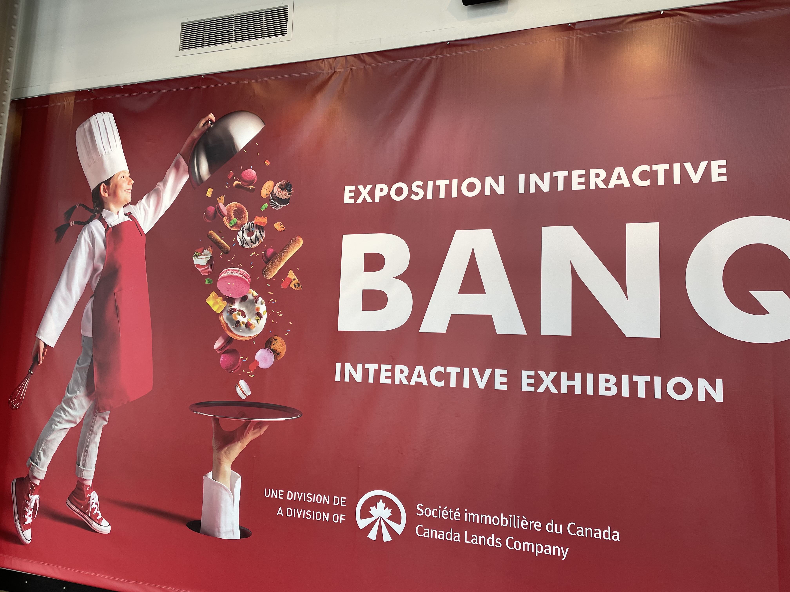
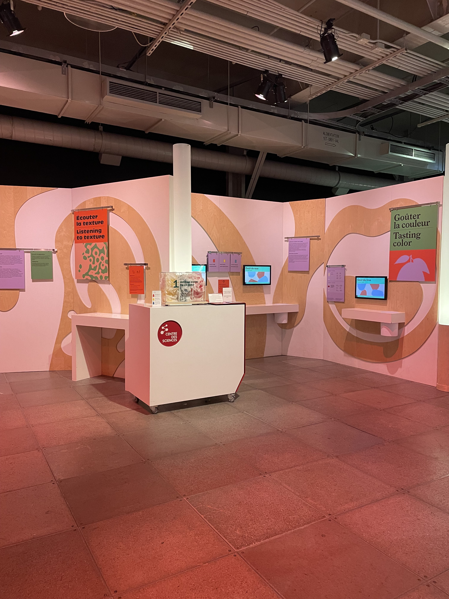

# Centre des sciences de Montréal
## Le Banquet ##

---------------
Le banquet est une exposition de type permanante qui utilise les cinq sens humain de plusieurs façons surprenantes. Nous avons eu la chance de voir cette exposition le 31 janvier 2025. 
---------------
Cependant, un dispotif en particulier m'a intéressé: Gouter la couleur

Cette expérience consistait de goûter un bonbon en même temps de répondre à des questions par rapport au goût de celui-ci. Le but était de prouver que la couleur des aliments influence le goût de celui-ci. Par exemple, le bonbon rouge était au citron, et non cerise ou fraise comme la plupart du monde pense. 

