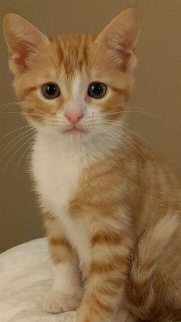
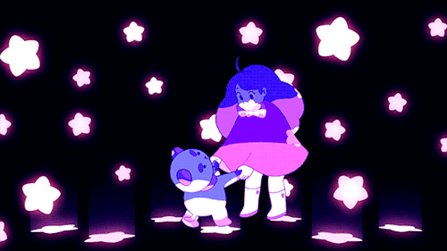

# Amélie Veilleux
---------------
## Plus sur moi
Je suis une personne artistique même si le cegep ne me donne pas beaucoup de temps pour réaliser des projets. J'aime la lecture, je pourrais passer mes journées à lire. De plus, une partie très importante de ma vie est mes chats, les chats sont définitivement supérieurs aux chiens. 

## Intérêts multimedia
Je suis principalement intéressé par **l'animation 2D/3D** et par le côté plus artistique du multimédia (illustration, design, etc.). L'animation m'a toujours passionné, ce qui peut s'expliquer par ma grande admiration pour les dessins animés et les films d'animation, comme ceux produits par Disney.

## Inspirations
J'ai plusieurs inspirations dans la vie, la plus importante étant Disney, j'ai toujours été fasciné par ce monde merveilleux. Des animations qui ont plus de 100 ans et qui ont marqués des générations. Raiponce est le film animés qui m'a le plus affecté, il suffit d'écouter un making-of du film pour réaliser la dure tâche de ce film. De plus,
