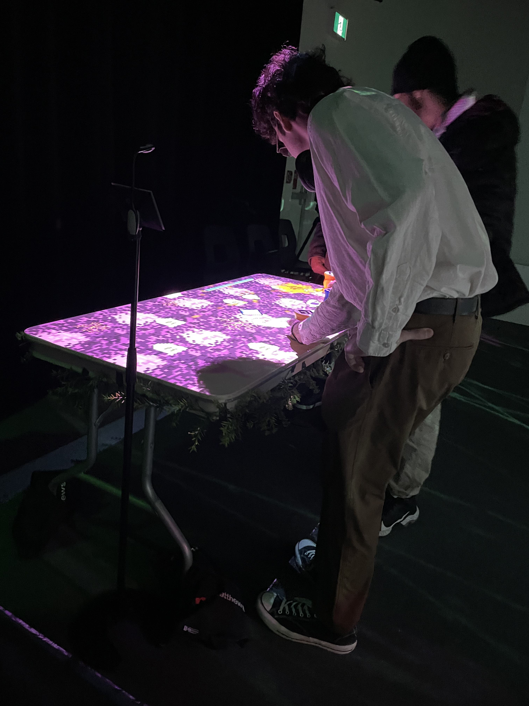
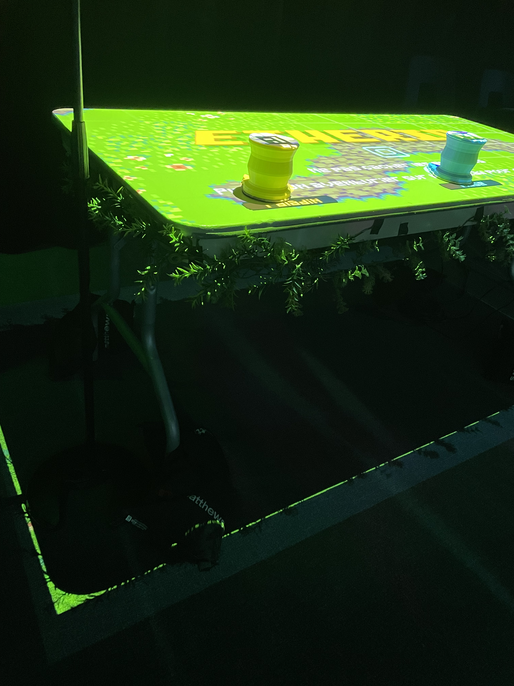
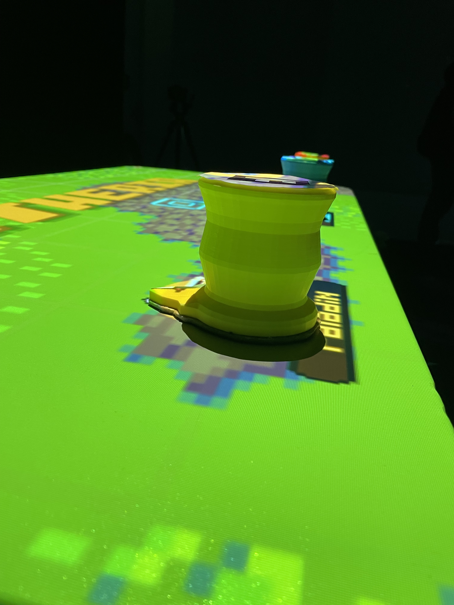

# Etheria #
Ce projet a été réalisé par Joshua Gonzualez-Barrera, Victor Gileau, Michael Un Dupré, Pierre-Luc Proulx et Maik Hamel. Nous avons pu voir ce projet grâce à l'exposition Resonnance le 21 mars 2025 au Cegep Montmorency.

----------
Parmi les sept projet, Etheria est lui qui m'a le plus fasciné et amusé.

Photo  de l'expérience par Amélie Veilleux

Ce projet est un jeu vidéo projeté sur une table. Grâce à des capteurs, nous pouvons y jouer avec des pions placés sur la table, comme on peut le voir sur la photo ci-dessus. Le jeu se déroule en plusieurs "rounds" et consiste à défendre un cristal contre les ennemis. Chaque personnage possède des compétences différentes, ce qui offre une expérience unique pour chaque joueur. L'expérience est donc interactive.

Photo de la table par Amélie Veilleux
### Plantation ###
Pour plus de détails sur l'installation de ce projet, je vous recommande de regarder la plantation faite par l'équipe. (Image en dessous)

Image trouvée sur le site d'Etheria

### Éléments nécessaires: ###
- Haut-parleurs ( et cables)
- Carte de son
- Projecteur ( et cables)
- Kinect ( et autres)
- Lumières infrarouges (et cables)
- Table
- Clamps normal
- Poteaux
- Caméra Sony
- Pion en impression 3D

Photo d'un pion par Amélie Veilleux
