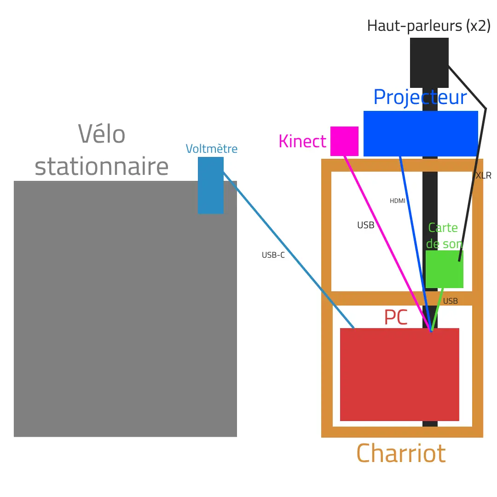

# Projets des finissants de la technique d'intégration multimedia #
Nous avons eu la chance d'aller voir le progrès sur les travaux finaux des finissants le 25 février 2025 et le 18 mars 2025. Il y aura une autre page parlant de mon exposition préférée mais pour l'instant, je vais vous présenter globalement les équipes et leur projet.
## C0NDU8 ##
#### Équipe: Ian Corbin, Samuel Desmeules Voyer, Alexandre Gervais, Kevin Malric et Jérémy Roy Coté ####
---------------
#### Installation du projet ####

Photo par Amélie Veilleux
#### Plantation du projet ####

#### Image trouvé sur le site de C0NDU8 ####
---------------

Ce projet m'a vraiment fasciné, je ne croyais pas voir un projet de ce genre réalisé par des finissants de la technique. Je trouve que celui-ci est bien pensé et plaisant à effectuer, il demande un certain effort physique ce que je trouve très créatif. Alors, bien évidemment, qu'après avoir réalisé celui-ci j'étais épuisé, car j'ai tout donné pour gagner.

Si nous nous penchons plus sur le côté dans l'intérieur de l'écran, il est évidemment que ce groupe ont eu besoin du cours de modélisation 3D pour réaliser le personnage et son environnement. Ensuite, pour bien former leur idée, le cours de conception d'une expérience multimédia est nécessaire. Cependant, ce projet n'aurait pas été possible sans le cours d'objets interactifs pour l'utilisation du vélo.

## Arcadia ##
#### Équipe: Dominic Yale, William Beauvais et Anton Nikulin ####
---------------
#### Installation du projet ####
Image
#### Plantation du projet ####
Image
---------------

Ce projet m'a fortement intéréssé quand je l'ai vu au loin, malgré qu'un jeu vidéo peut être vu comment une idée simple pour un projet commme celui-ci, je trouve que celui-ci resort parmi les autres. Je trouve que le design de ce jeu  est très nostalgique et vintage. Le jeu en tant que telle est intéréssant sans être trop compliqué ce qui permet à tout le monde d'y jouer. J'ai adoré mon expérience en y jouant et j'étais très content d'avoir essayer celui-ci. 

Cette équipe n'aurait pas réussi à réaliser ce projet sans le cours d'animation 2D pour la cération des personnages et de l'environnement. Comme tous les projets, le cours de conception d'une expérience multimédia a été nécessaire à la création de ce jeu. De plus, cette équipe a eu besoin du cours programmation interactive pour réaliser la fonction web de ce porjet.

## Prismatica ##
#### Équipe: Vincent Delisle, Ikrame Rata et Jérémy Duverseau ####
---------------
#### Installation du projet ####

Photo par Amélie Veilleux
#### Plantation du projet ####

#### Image trouvé sur le site de Prismatica ####
---------------
Personnellement, j'ai trouvé ce projet fascinant, celui-ci nous permet d'utiliser de la créativité en rendant nos créations vivantes, ces dernières s'animent et font une petite musique ce qui est très amusant.

## Fuga ##
#### Équipe: Matis, Tristan, Daniel, Abdel et Avuz ####
---------------

## Internature ##
#### Équipe: Khaly Tia Sing, Isaac Fafard, Delphine Grenier, Sitmonemna Yi et Kenza El Harrif ####
---------------

